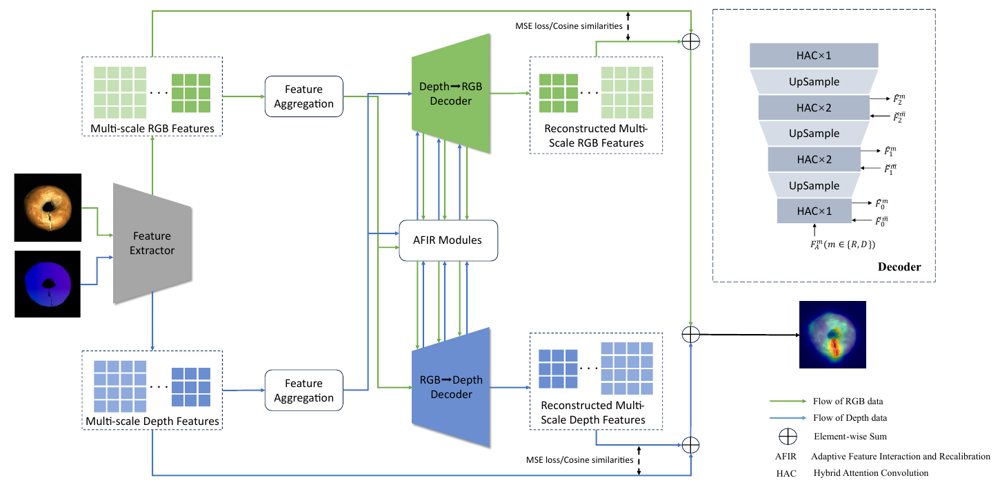
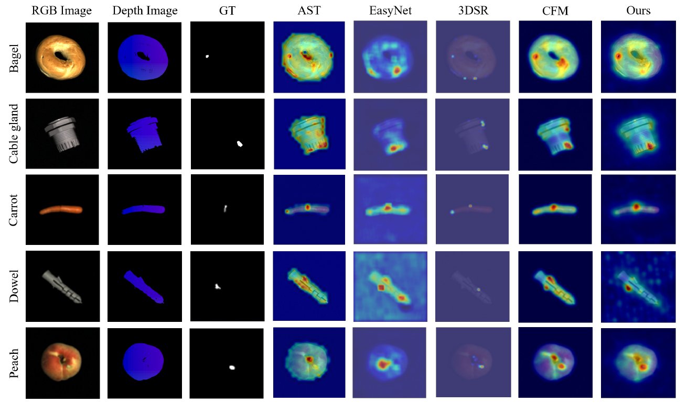

# ECFR: An Efficient Cross-modal Feature Reconstruction Model for Multimodal Multi-class Anomaly Detection

Official implementation of **An Efficient Cross-modal Feature Reconstruction Model for Multimodal Multi-class Anomaly Detection**, accepted at **NeurIPS 2026**.

## Introduction

**Efficient Cross-modal Feature Reconstruction (ECFR)** detects and localizes anomalies across multiple object categories using a single model trained on normal RGB-depth pairs. Cross-modal reconstruction exploits inter-modal heterogeneity to alleviate the identical shortcut problem and amplify anomaly signals.

The main model is in `model/ecfr.py`, with training in `trainer/ecfr.py` and dataset configurations in `configs/mvtec3d.py` and `configs/eyecandies.py`.

ECFR consists of two core modules:

- **Adaptive Feature Interaction and Recalibration (AFIR)** models intra- and inter-modal dependencies and adaptively recalibrates feature channels.
- **Hybrid Attention Convolution (HAC)** combines Agent Attention with parallel multi-kernel depth-wise convolutions to capture global context and local structures.



*Overall framework of ECFR (Figure 2 in the paper). A frozen, shared ResNet-34 extracts multi-scale features for bidirectional cross-modal reconstruction.*

## Setup

The paper reports experiments using **PyTorch 1.13** on an **NVIDIA A800 80GB GPU**. Install a compatible CUDA-enabled PyTorch/torchvision pair, then install the remaining dependencies:

```bash
git clone https://github.com/wang1393/neurips2026_20280.git
cd neurips2026_20280
pip install -r requirements.txt
```

The backbone uses timm's pretrained ResNet-34 weights. The dependency list is provisional; the complete paper environment has not yet been pinned.

## Datasets

Download [MVTec 3D-AD](https://www.mvtec.com/company/research/datasets/mvtec-3d-ad) and [Eyecandies](https://eyecan-ai.github.io/eyecandies/), and prepare aligned RGB images, organized XYZ TIFFs, ground-truth masks, and `meta.json`:

```text
data/
├── mvtec3d/
│   ├── meta.json
│   └── ...
└── eyecandies_preprocessed/
    ├── meta.json
    └── ...
```

## Train and Test

Run from the repository root. Each configuration trains one model on all categories:

```bash
# Train on MVTec 3D-AD
python run.py -c configs/mvtec3d.py -m train

# Train on Eyecandies
python run.py -c configs/eyecandies.py -m train
```

Training uses 256 × 256 inputs, AdamW, and 500 epochs. Logs and checkpoints are saved under `runs/`.

Evaluate with a trained checkpoint:

```bash
# Test on MVTec 3D-AD
python run.py -c configs/mvtec3d.py -m test \
  model.kwargs.checkpoint_path=checkpoints/ecfr_mvtec3d.pth

# Test on Eyecandies
python run.py -c configs/eyecandies.py -m test \
  model.kwargs.checkpoint_path=checkpoints/ecfr_eyecandies.pth
```

The paths above are examples; trained checkpoints are not included. Override dataset paths with `data.root=/path/to/mvtec3d` or `data.root=/path/to/eyecandies_preprocessed`.

## Results

Multi-class results reported in the paper (Table 1 and Table 7; all metrics in %):

| Dataset | I-AUROC | P-AUROC | AUPRO |
| --- | ---: | ---: | ---: |
| MVTec 3D-AD | 91.85 | 98.60 | 95.37 |
| Eyecandies | 86.64 | 97.13 | 90.21 |

Table 2 reports **44.627M parameters**, **15.762 GFLOPs**, and **21.356 FPS** on an NVIDIA A800 80GB GPU. These are paper-reported results; the current release has not been independently revalidated.



*Qualitative comparison on MVTec 3D-AD (Figure 4 in the paper). Columns show RGB, depth, ground truth, baseline predictions, and ECFR (Ours).*

## Citation

If you find this work useful, please cite **An Efficient Cross-modal Feature Reconstruction Model for Multimodal Multi-class Anomaly Detection (NeurIPS 2026)**. The paper link and complete BibTeX entry will be added when the final publication metadata is available.

## Acknowledgement

We appreciate the following github repos for their valuable code:

- [UniAD](https://github.com/zhiyuanyou/UniAD)
- [MambaAD](https://github.com/lewandofskee/MambaAD)
- [ADer](https://github.com/zhangzjn/ADer#train-multi-class-unsupervised-ad-setting-by-default-muad)
